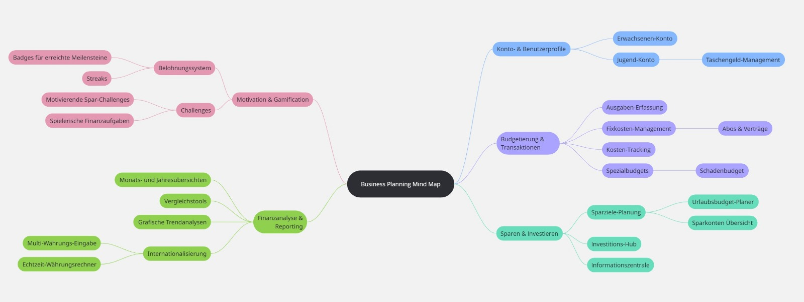
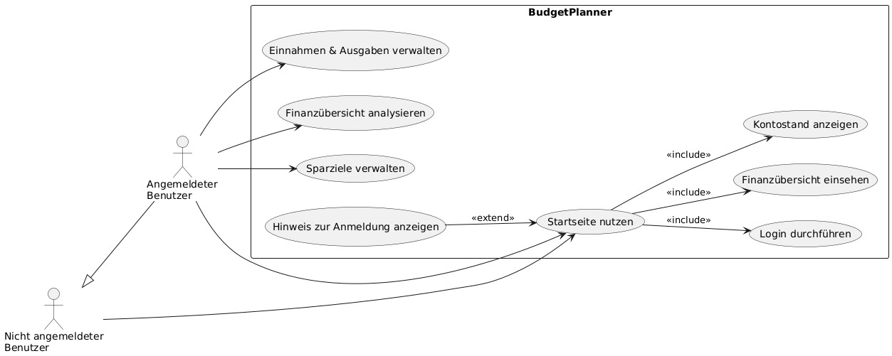
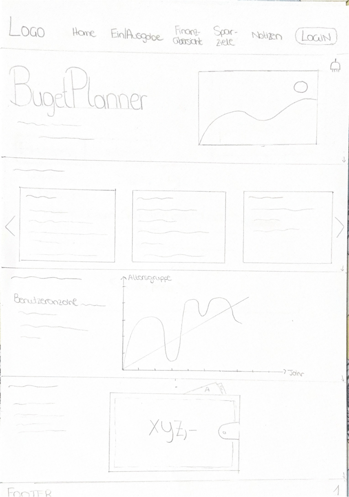
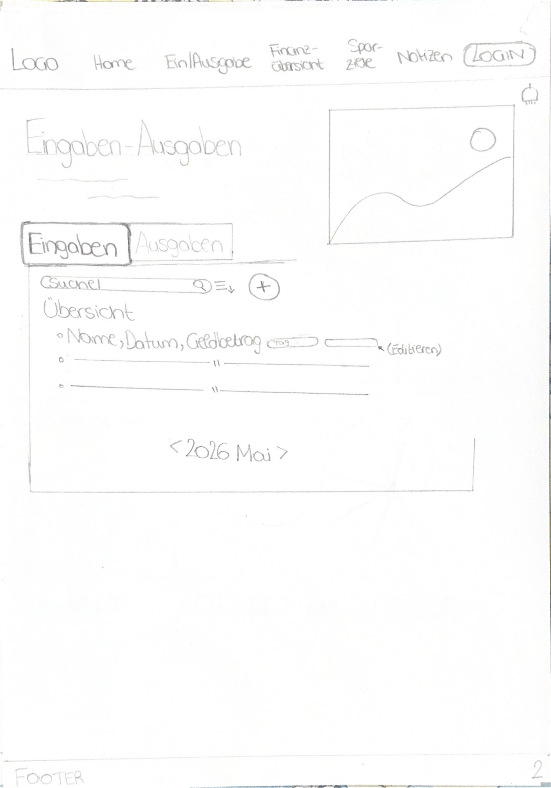
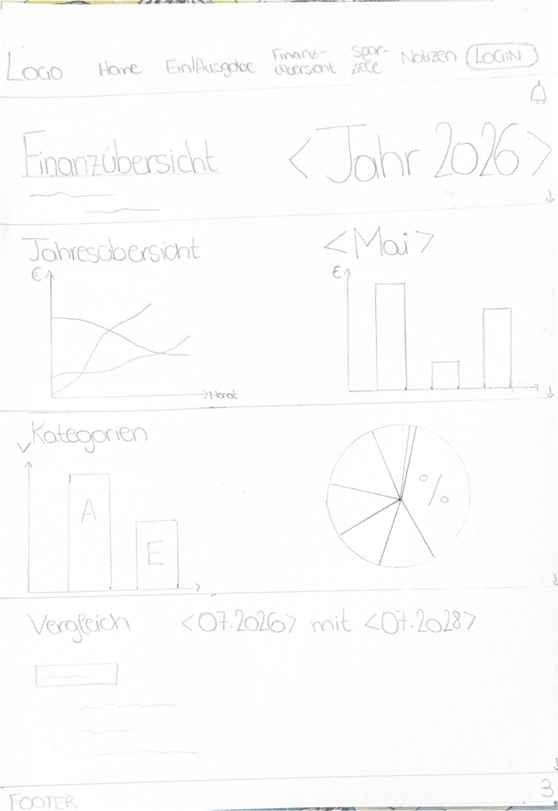
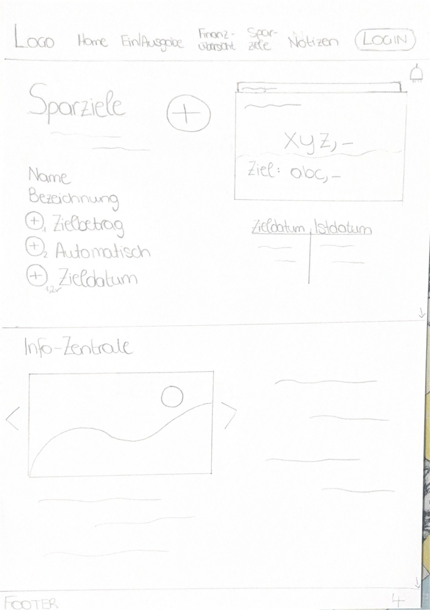
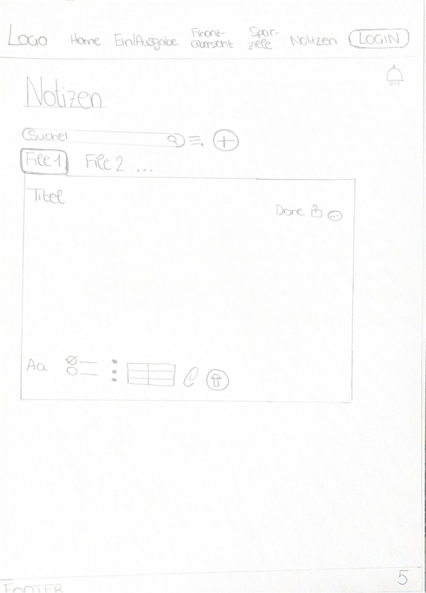
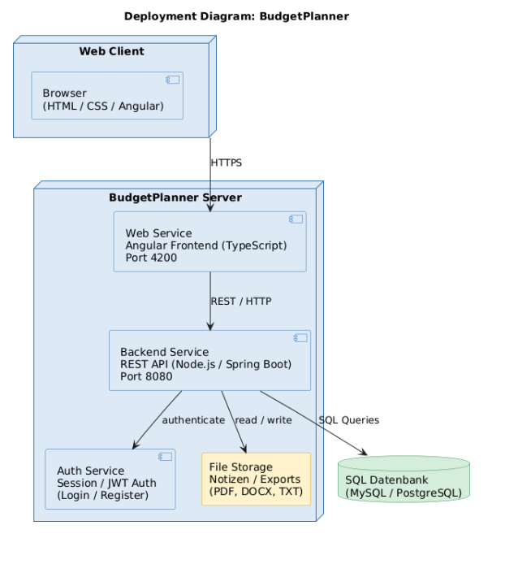
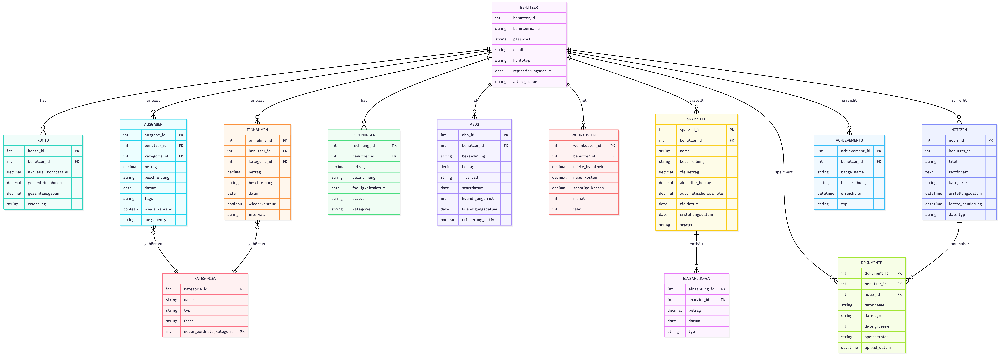

# BudgetPlanner
## Inhaltsverzeichnis

- [1. Ausgangslage](#1-ausgangslage)
  - [1.1 Ist-Situation](#11-ist-situation)
  - [1.2 Verbesserungspotenziale](#12-verbesserungspotenziale)

- [2. Zielsetzung](#2-zielsetzung)
- [3. Funktionale Anforderungen](#3-funktionale-anforderungen)
  - [3.1 Use Case A](#31-use-case-a) Home
  - [3.2 Use Case B](#32-use-case-b) Eingaben & Ausgaben verwalten
  - [3.3 Use Case C](#33-use-case-c) Finanzübersicht und Auswertung
  - [3.4 Use Case D](#34-use-case-d) Sparziele verwalten
  - [3.5 Use Case E](#35-use-case-e) Notizen

- [5. Mengengerüst](#5-mengengerüst)

- [6. Systemarchitektur](#6-systemarchitektur)
  - [6.1 Deployment Diagramm](#61-deployment-diagramm)
  - [6.2 Datenmodell](#62-datenmodell)

Live-System
Die Anwendung ist öffentlich erreichbar unter:
http://if230131.cloud.htl-leonding.ac.at

## 1. Ausgangslage

Privatpersonen stehen zunehmend vor der Herausforderung, ihre täglichen Ausgaben, Sparziele und finanziellen Verpflichtungen transparent und effizient zu verwalten. Derzeit erfolgt die Budgetplanung meist manuell oder über unübersichtliche Tabellen. Es fehlt ein zentrales, benutzerfreundliches System, das verschiedene Aspekte der persönlichen Finanzplanung vereint. Von Taschengeldverwaltung bis hin zur Jahresauswertung.

Ein Online-Tool kann helfen, den Überblick über Geld und Sparziele endlich einfacher zu machen.

### 1.1 Ist-Situation

Derzeit befindet sich das Projekt in der Konzeptionsphase. Aktuell wurde das Datenmodell (ER-Diagramm) fertiggestellt und dient als Grundlage für die weitere Entwicklung.

### 1.2 Verbesserungspozenzial

#### Vorteile des Projekts

- Menschen lernen besser mit ihrem Geld umzugehen
- Finanzen werden digital und einfacher verwaltet
- Die Website kann auch von Einzelpersonen, Familien und Jugendlichen genutzt werden

#### Mögliche Probleme

- Die Datenstruktur kann kompliziert sein
- Datenschutz muss streng eingehalten werden
- Manche Nutzer sind vielleicht skeptisch gegenüber neuen Systemen

#### Lösungen

- Schon früh Nutzer einbinden und testen lassen
- Datenschutz nach den aktuellen Regeln (DSGVO) umsetzen
- Die Website in kleinen Teilen entwickeln und Schritt für Schritt erweitern

#### SWOT-Analyse

| **Stärken** | **Schwächen** |
|-------------|---------------|
| Team arbeitet gut zusammen und bringt verschiedene Kenntnisse mit | Wenig Zeit für die ganze Entwicklung |
| Klare Ziele und gute Organisation | Wissen liegt oft nur bei einzelnen Personen |
| Team ist flexibel und lernbereit | Wenig Erfahrung |

| **Chancen** | **Risiken** |
|-------------|-------------|
| Immer mehr Menschen nutzen Finanz-Apps | Viele starke Konkurrenten am Markt |
| Nutzer wünschen sich mehr Transparenz und Kontrolle | Strenge Regeln und Gesetze |
| Bestimmte Gruppen (z. B. Privatpersonen, Jugendliche) können gezielt angesprochen werden | Manche Zielgruppen sind skeptisch gegenüber digitalen Finanzlösungen |
| Zusammenarbeit mit Banken oder FinTechs möglich | Abhängigkeit von App-Stores und Technik anderer Anbieter |

---

## 2. Zielsetzung

Das Ziel ist die Entwicklung einer webbasierten Sparplattform mit folgenden Kernfunktionen:

### *Feature-Mindmap*

### A. Konten & Nutzerprofile

#### Erwachsenen-Konto

- Voller Funktionsumfang  
- Ausgaben, Einnahmen, Rücklagen, Kredite  
- Kann auch ins Minus gehen  
- Überblick über regelmäßige Kosten (Miete, Abos, Verträge usw.)

#### (Optional) Jugend-/Kinder-Konto

- Wenn benötigt – kann später aktiviert werden  
- Fokus auf Sparziele und positive Kontostände  
- Kein Schulden- oder Minusbereich  
- Geeignet für Taschengeld & einfache Finanzbildung

#### (Optional) Taschengeld & Familienfunktionen

- Eltern können digitales Taschengeld vergeben  
- Überblick über Ziele, Fortschritt und Belohnungen  
- Einfaches Eltern-Management

---

### B. Ausgaben, Rechnungen & tägliche Finanzen

#### 1. Alltagsausgaben

- Schnellerfassung für typische Kosten (Essen, Auto, Freizeit)  
- Kategorien & Unterkategorien  
- Notizen, Tags, wiederkehrende Ausgaben

#### 2. Rechnungen & Verpflichtungen

- Einmalige Rechnungen (Arzt, Reparatur, Versicherung usw.)  
- Übersicht über offene / bezahlte Rechnungen  
- Erinnerung an Fälligkeiten

#### 3. Fixkosten & Abos

- Netflix, Handyvertrag, Fitnessstudio, Versicherung etc.  
- Kündigungsfristen + automatische Erinnerungen  
- Monatsübersicht: Was kostet mich meine „Grundversorgung“?

#### 4. Wohnkosten

- Miete, Nebenkosten, Hypothek oder Kredit  
- Anpassbar je nach Wohnsituation  
- Gesamtübersicht deiner monatlichen Belastung

#### 5. (Optional) Notfall- & Spezialbudgets

- Reparaturfonds („Schadenbudget“)  
- Vorschlag: X% des Einkommens für Puffer  
- Markierung von unerwarteten Ausgaben

---

### C. Auswertungen & Finanz-Übersicht

#### Finanz-Insights

- Monats- und Jahresübersicht  
- Welche Kategorien nehmen am meisten Geld?  
- Vergleich Vormonat – aktueller Monat

#### Trendanalysen

- Langfristige Ausgabenentwicklung  
- Sparverhalten im Überblick

---

### D. Sparziele & (Optional) Investments

#### Sparziele

- Urlaubsbudget, neues Handy, Notgroschen usw.  
- Automatische Sparrate berechnen  
- Fortschrittsanzeige (Prozent, Zeit, Restbetrag)

#### Übersicht über Rücklagen & Sparkonten

- Alle Rücklagen auf einen Blick  
- Umbuchungen zwischen Zielen

#### Informationszentrale („Spar-Wissen“)

- Durchschnittskosten von Lebensbereichen  
- Tipps für besseres Sparen

---

### E. (Optional) Motivation & Gamification

#### Belohnungssystem

- Badges für Spar-Meilensteine  
- Streaks für regelmäßiges Sparen

---

## 3. Funktionale Anforderungen

Das Use-Case-Diagramm zeigt die Funktionen der Anwendung BudgetPlanner für angemeldete und nicht angemeldete Benutzer. Nicht angemeldete Benutzer können die Startseite nutzen und sich anmelden. Angemeldete Benutzer haben Zugriff auf Funktionen wie das Verwalten von Einnahmen und Ausgaben, das Analysieren der Finanzübersicht sowie das Verwalten von Sparzielen. Über die Startseite können außerdem der Kontostand angezeigt, die Finanzübersicht eingesehen und der Login durchgeführt werden.

### 3.1 Use Case A
### _Startseite(Home)_
**Beschreibung:** Die Startseite bietet dem Benutzer einen schnellen Überblick über die wichtigsten Inhalte des BudgetPlanners.

**Funktionen:**

 - Grafische Übersicht der Finanzen
    
- Informationskarten in einem Karussell
    
- Anzeige der Benutzeranzahl nach Altersgruppen (Liniendiagramm)
    
- Digitale Brieftasche zur Anzeige des Kontostands
    
- Nicht angemeldete Benutzer erhalten einen Hinweis zur Anmeldung
    
- Angemeldete Benutzer sehen ihr aktuelles Guthaben
    
- Klick auf Karten führt zu den jeweiligen Ein- oder Ausgaben
    
- Navigation zu allen weiteren Seiten der Website
    
- Login-Funktion mit Benutzerprofil und Speicherung persönlicher Daten
    

### 3.2 Use Case B
### _Eingaben & Ausgaben verwalten_

**Beschreibung:** Dieser Use Case ermöglicht es dem Benutzer, Einnahmen und Ausgaben zu erfassen, zu bearbeiten und gezielt zu durchsuchen.

**Funktionen:**

- Erfassung neuer Einnahmen und Ausgaben
    
- Angabe von Betrag, Art und Bezeichnung (Grund)
    
- Übersichtliche Listenansicht aller Einträge
    
- Suchfunktion zum schnellen Finden von Einträgen
    
- Bearbeiten und Anpassen bestehender Einträge
    
- Anzeige der Gesamtausgaben und Einsparungen
    

### 3.3 Use Case C
### _Finanzübersicht & Auswertungen_

**Beschreibung:** Dieser Use Case dient der Analyse der finanziellen Entwicklung über verschiedene Zeiträume hinweg.

**Funktionen:**

- Auswahl eines gewünschten Jahres als Datenbasis
    
- Anzeige einer Jahresübersicht mit Balkendiagramm (monatliche Einnahmen & Ausgaben)
    
- Auswahl einzelner Monate per Klick
    
- Kreisdiagramm zur prozentualen Aufteilung der Ausgabenkategorien
    
- Filterung nach Kategorien mit dynamischer Anpassung der Diagramme
    
- Vergleich von zwei beliebigen Monaten (auch aus unterschiedlichen Jahren)
    
- Listenansicht aller Einnahmen und Ausgaben zum direkten Vergleich
    

### 3.4 Use Case D
### _Sparziele verwalten_

**Beschreibung:**  
Dieser Use Case ermöglicht es dem Benutzer, individuelle Sparziele zu erstellen, zu verfolgen und zu verwalten. Zielbeträge, automatische Sparraten und Fortschrittsanzeigen helfen beim Erreichen der Ziele. Eine Informationszentrale liefert Tipps und Hinweise rund ums Sparen.

**Funktionen:**

- Neues Sparziel erstellen: Name, optional Beschreibung, Zielbetrag
- Übersicht aller Sparziele: Name, aktueller Betrag, Zielbetrag, Fortschrittsbalken
- Einzahlungen: manuell eingeben oder automatische Sparrate aktivieren
- Zieldatum berechnen basierend auf Zielbetrag und Sparrate
- Bestehende Sparziele bearbeiten oder löschen
- Detailansicht eines Sparziels: Einzahlungsverlauf, Fortschritt, Restbetrag
- Informationszentrale (Karussell-Format): Spartipps, durchschnittliche Kosten, Hinweise zu besserem Sparverhalten

### 3.5 Use Case E
### _Notizen_

**Beschreibung:**  
Dieser Use Case ermöglicht es dem Benutzer, Notizen und Dokumente zu erstellen, zu verwalten, zu bearbeiten und zu organisieren. Er dient als zentrale Ablage für finanzbezogene Notizen, Verträge, Rechnungen, Ideen oder sonstige wichtige Informationen innerhalb des BudgetPlanners.

**Funktionen:**

- Erstellen neuer Notizen mit Titel und Textinhalt
- Bearbeiten und Aktualisieren bestehender Notizen und Dateien
- Speichern von Änderungen in Echtzeit oder per Button
- Löschen von Notizen und Dateien
- Suchfunktion zum schnellen Finden von Notizen und Dokumenten
- Filterfunktion (z. B. nach Datum, Kategorie, Dateityp, Titel)
- Hinzufügen weiterer Notizen oder Dateien per Klick
- mwandeln / Exportieren von Notizen in:
  - PDF  
  - Word (.docx)  
  - Textdatei (.txt)
- Download-Funktion für gespeicherte Dateien
- Verschiedene Textfunktionen (Word-Funktionen)
- Möglichkeit, Notizen bestimmten Kategorien zuzuordnen (z. B. Verträge, Rechnungen, Ideen, Sparpläne)
- Anzeige einer Listenansicht aller Notizen und Dateien
- Vorschau von Dokumenten direkt im System (ohne Download)

---
## 5. Mengengerüst

Zur groben Abschätzung der benötigten Systemressourcen wird folgendes Mengengerüst definiert. Die Angaben basieren auf realistischen Annahmen für ein schulisches Webprojekt.

- **Anzahl der Benutzer:**
    
    - ca. **100–300 Benutzer** in der Anfangsphase
        
    - optionales Wachstum auf **bis zu 1.000 Benutzer**
        
- **Datenmenge pro Benutzer:**
    
    - Speicherung von Profildaten sowie Einnahmen- und Ausgabeneinträgen
        
    - ca. **300–800 Einträge pro Jahr**
        
    - geschätzte Datenmenge: **unter 5 MB pro Benutzer**
        
- **Anfrage-Frequenz:**
    
    - ca. **5–20 Serveranfragen pro Sitzung** (z. B. Laden von Seiten, Diagrammen, Suchanfragen)
        
---
## 6. Systemarchitektur

### 6.1 Deployment-Diagramm

### 6.2 Datenmodell

